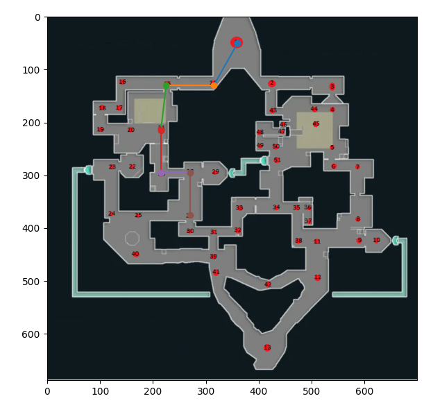
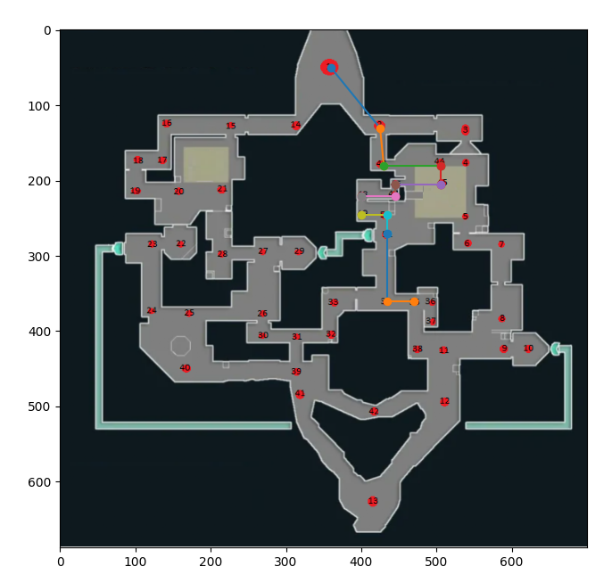
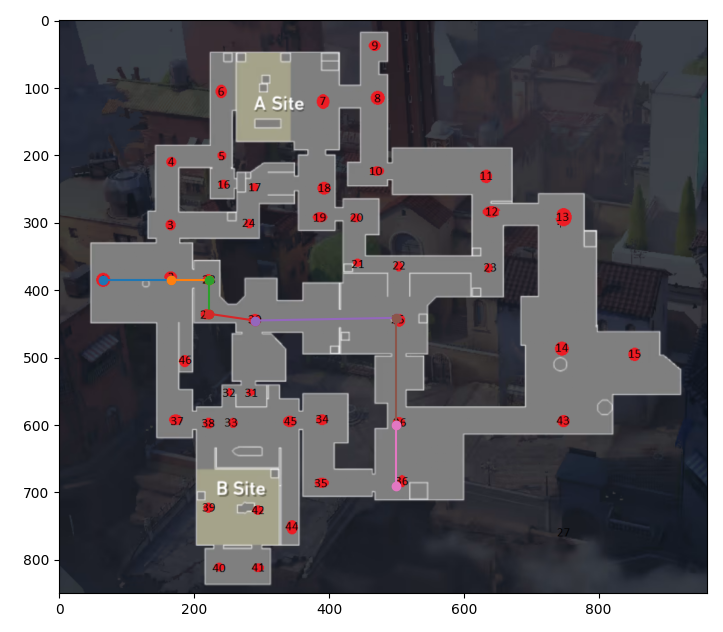

# Quem precisa de mapas

**Número da Lista**: X<br>
**Conteúdo da Disciplina**: Final<br>

## Alunos

| Matrícula  | Aluno                            |
| ---------- | -------------------------------- |
| 18/0054082 | Marcelo Victor de Sousa Silva    |
| 18/0029223 | Washington Bispo Arishita Junior |

## Sobre 

Esse projeto utiliza do algoritimo floyd-warshall para descrever o caminho mais próximo de um ponto a outro nos mapas do valorant, te auxiliando a jogar melhor.

## Screenshots





## Instalação 
**Linguagem**: python<br>

## Uso 

Para utilizar o projeto siga os seguintes passos:

1 - certifique-se de ter já instalado o python em seu sistema

2 - instale o pip

3 - e instale as dependências mostradas logo abaixo

```
pip install matplotlib
pip install numpy
```
4 - por fim rode o projeto

```
python Warshall.py
```

## Apresentação

O link da apresentação pode ser encontrado no seguinte link:

<>

e também na pasta raiz com o nome:

```
./
```
